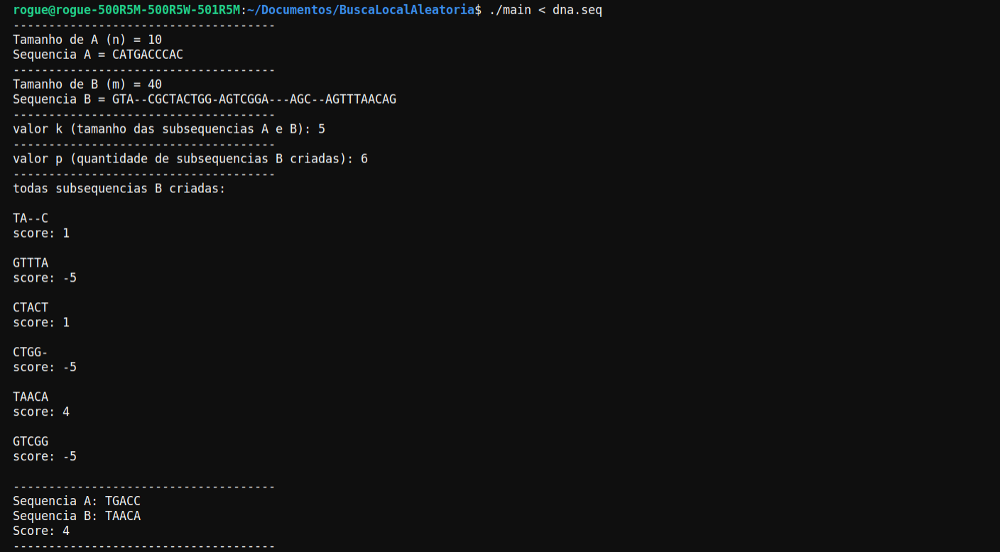

Projetos de Supercomputação do 1o. Semestre/2022

# Parte 2 - Um algoritmo Local para Alinhamento

Como vimos em aula, aleatoriedade é uma estratégia bastante comum para construção de algoritmos de busca local, podendo ser usada de forma isolada ou de forma complementar a outra estratégia de varredura de um espaço de soluções. Em problemas de alinhamento, varreduras suportadas por aleatoriedade tem produzido algoritmos bastante efetivos.

Dentro deste contexto, vamos considerar o algoritmo proposto abaixo:

ALGORITMO BUSCA LOCAL COM ALEATORIEDADE

Entrada: Duas sequencias de DNA a[i] e b[j], de tamanhos n e m respectivamente,pesos wmat, wmis e wgap para match, mismatch e gap respectivamente

Saída: Score de um alinhamento das sequencias Subsequencias alinhadas

1. Gerar uma subsequencia sb=b[j,j+1,...,j+k] de b, de tamanho aleatório k, 1<=k<=m, e 0<=j<=m
2. Gerar um número aleatório inteiro positivo p
3. Gerar p subsequencias sa=a[i,i+1,...,i+k] de a, com tamanho k calculado no passo (1), 0<=i<=n
4. Calcular os scores de cada par (sa,sb) com os pesos wmat, wmis e wgap
5. Devolver o score máximo m entre os scores do passo (4) e as subsequencias associadas a ele

Abaixo pode-se ver a saida do programa com duas Sequencias de DNA diferentes:

